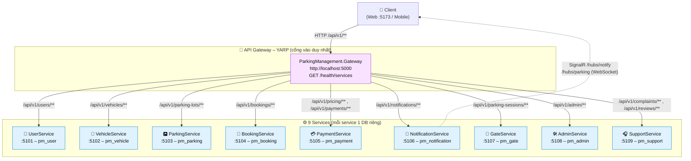
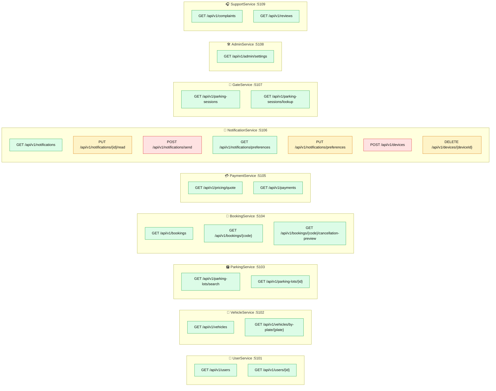
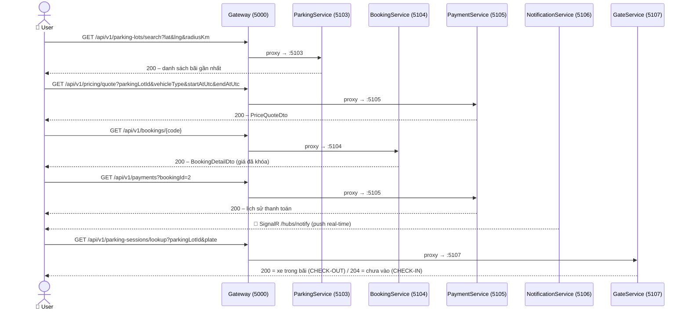

# 🗺️ API Diagram

Tài liệu hình ảnh hóa toàn bộ REST API của hệ thống **ParkingManagement** (9 service + YARP Gateway).
Định dạng **Mermaid** – hiển thị trực tiếp trên GitHub, VS Code (extension Mermaid), GitLab, v.v.

> Nguồn tương ứng: `Gateway/ParkingManagement.Gateway/appsettings.json` (routing),
> các `*Controller.cs` trong `Services/<Tên>Service/<Tên>Service.API/Controllers/`.

---

## 1️⃣ API Topology – Gateway → Services

**Ghi chú:**
- Gateway dùng **YARP** (`ReverseProxy` trong `appsettings.json`), route prefix match `{**rest}` – mọi request giữ nguyên path khi chuyển downstream.
- Mỗi service có sẵn `/health` và `/openapi/v1.json` (OpenAPI/Swagger).
- ⚠️ **`/api/v1/devices` (DeviceTokenController) và `/hubs/*` chưa có route trong Gateway** – hiện chỉ gọi trực tiếp `:5106`. Nếu muốn truy cập qua Gateway cần thêm route vào `appsettings.json`.

---

## 2️⃣ Endpoint Map – Toàn bộ REST API

**Chú thích màu:**
- 🟢 **GET** – đọc dữ liệu (read-only)
- 🟡 **PUT** – ghi dữ liệu (mutation)
- 🔴 **POST / DELETE** – internal API hoặc quản lý thiết bị

---

## 3️⃣ Sequence – Luồng đặt chỗ chuẩn qua Gateway

---

## 4️⃣ Gateway Routing Reference

```mermaid
graph TB
	Req["HTTP Request<br/>http://localhost:5000/..."]

	R1["/api/v1/users/**<br/>→ cluster user :5101"]
	R2["/api/v1/vehicles/**<br/>→ cluster vehicle :5102"]
	R3["/api/v1/parking-lots/**<br/>→ cluster parking :5103"]
	R4["/api/v1/bookings/**<br/>→ cluster booking :5104"]
	R5["/api/v1/pricing/**<br/>→ cluster payment :5105"]
	R6["/api/v1/payments/**<br/>→ cluster payment :5105"]
	R7["/api/v1/notifications/**<br/>→ cluster notification :5106"]
	R8["/api/v1/parking-sessions/**<br/>→ cluster gate :5107"]
	R9["/api/v1/admin/**<br/>→ cluster admin :5108"]
	R10["/api/v1/complaints/**<br/>→ cluster support :5109"]
	R11["/api/v1/reviews/**<br/>→ cluster support :5109"]

	Req --> R1 & R2 & R3 & R4 & R5 & R6 & R7 & R8 & R9 & R10 & R11

	classDef route fill:#f1f5f9,stroke:#475569,color:#111
	class R1,R2,R3,R4,R5,R6,R7,R8,R9,R10,R11 route
```

---

## 📋 Bảng tổng hợp endpoint

| # | Method | Route | Service | Port | Mô tả |
|---|--------|-------|---------|------|-------|
| 1 | GET | `/api/v1/users` | UserService | 5101 | Danh sách user (UC-40) |
| 2 | GET | `/api/v1/users/{id}` | UserService | 5101 | Hồ sơ user + vai trò |
| 3 | GET | `/api/v1/vehicles?userId=` | VehicleService | 5102 | Garage xe (UC-07) |
| 4 | GET | `/api/v1/vehicles/by-plate/{plate}` | VehicleService | 5102 | Tra xe theo biển số (OCR) |
| 5 | GET | `/api/v1/parking-lots/search` | ParkingService | 5103 | Tìm bãi gần nhất (UC-08) |
| 6 | GET | `/api/v1/parking-lots/{id}` | ParkingService | 5103 | Chi tiết bãi (UC-09) |
| 7 | GET | `/api/v1/bookings` | BookingService | 5104 | Booking của tôi (UC-13) |
| 8 | GET | `/api/v1/bookings/{code}` | BookingService | 5104 | Chi tiết booking |
| 9 | GET | `/api/v1/bookings/{code}/cancellation-preview` | BookingService | 5104 | Hoàn tiền khi hủy (UC-16) |
| 10 | GET | `/api/v1/pricing/quote` | PaymentService | 5105 | Báo giá trước khi đặt (UC-11) |
| 11 | GET | `/api/v1/payments?bookingId=` | PaymentService | 5105 | Thanh toán theo booking (UC-19) |
| 12 | GET | `/api/v1/notifications` | NotificationService | 5106 | Hộp thông báo |
| 13 | PUT | `/api/v1/notifications/{id}/read` | NotificationService | 5106 | Đánh dấu đã đọc |
| 14 | POST | `/api/v1/notifications/send` | NotificationService | 5106 | Gửi thông báo (internal/admin) |
| 15 | GET | `/api/v1/notifications/preferences` | NotificationService | 5106 | Cài đặt thông báo |
| 16 | PUT | `/api/v1/notifications/preferences` | NotificationService | 5106 | Cập nhật cài đặt |
| 17 | POST | `/api/v1/devices` | NotificationService | 5106 | Đăng ký FCM token |
| 18 | DELETE | `/api/v1/devices/{deviceId}` | NotificationService | 5106 | Hủy FCM token |
| 19 | GET | `/api/v1/parking-sessions` | GateService | 5107 | Xe đang trong bãi (UC-20) |
| 20 | GET | `/api/v1/parking-sessions/lookup` | GateService | 5107 | Tra xe tại cổng |
| 21 | GET | `/api/v1/admin/settings` | AdminService | 5108 | 24 tham số + 8 flag (UC-44) |
| 22 | GET | `/api/v1/complaints` | SupportService | 5109 | Hộp tranh chấp (UC-38) |
| 23 | GET | `/api/v1/reviews?parkingLotId=` | SupportService | 5109 | Đánh giá bãi (UC-18) |
| — | WS | `/hubs/notify`, `/hubs/parking` | NotificationService | 5106 | SignalR real-time (chưa qua Gateway) |
| — | GET | `/health`, `/openapi/v1.json` | Tất cả service | — | Health check + OpenAPI |
| — | GET | `/health/services` | Gateway | 5000 | Trạng thái 9 service |

---

## 🔗 Liên quan

- `ARCHITECTURE_DIAGRAMS.md` – C4 diagrams (context, container, component, deployment…)
- `API_SPECIFICATION.md` – chi tiết request/response của NotificationService
- `Services/NotificationService/API_DIAGRAM.md` – **API diagram chi tiết NotificationService (TV6)**: sequence gửi + retry transient/permanent, SignalR hub, error mapping
- `README.md` – cấu trúc dự án & cách chạy

