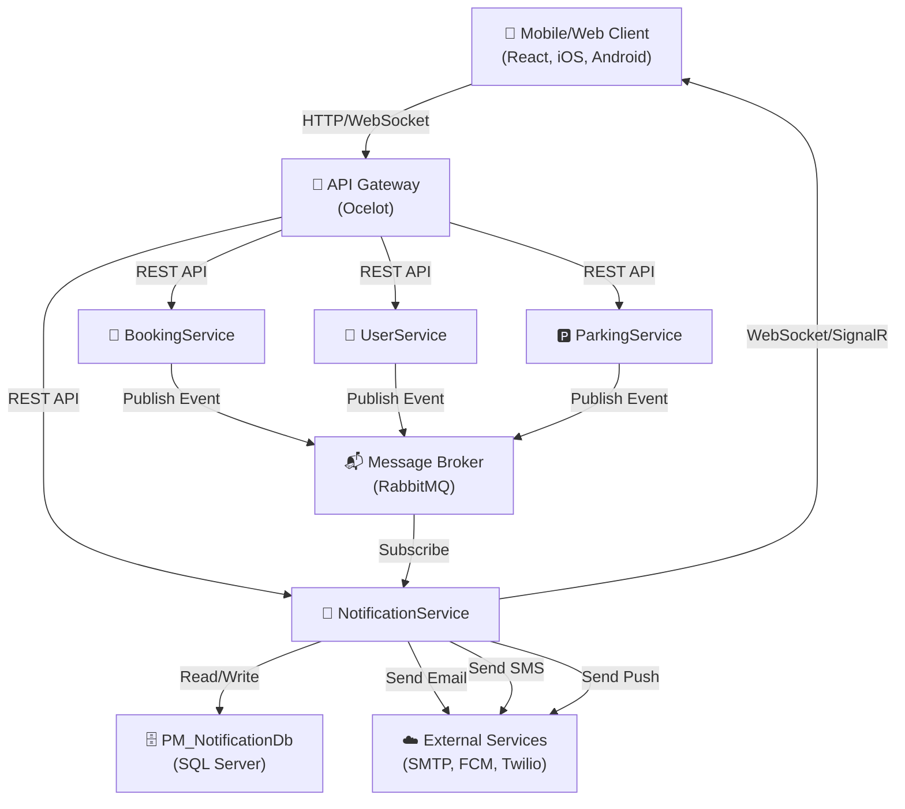
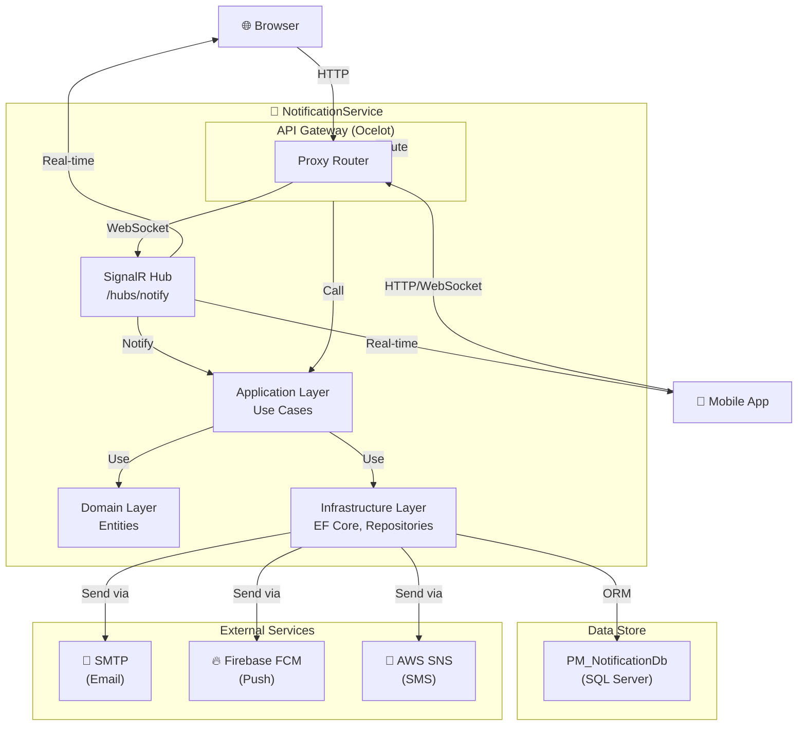
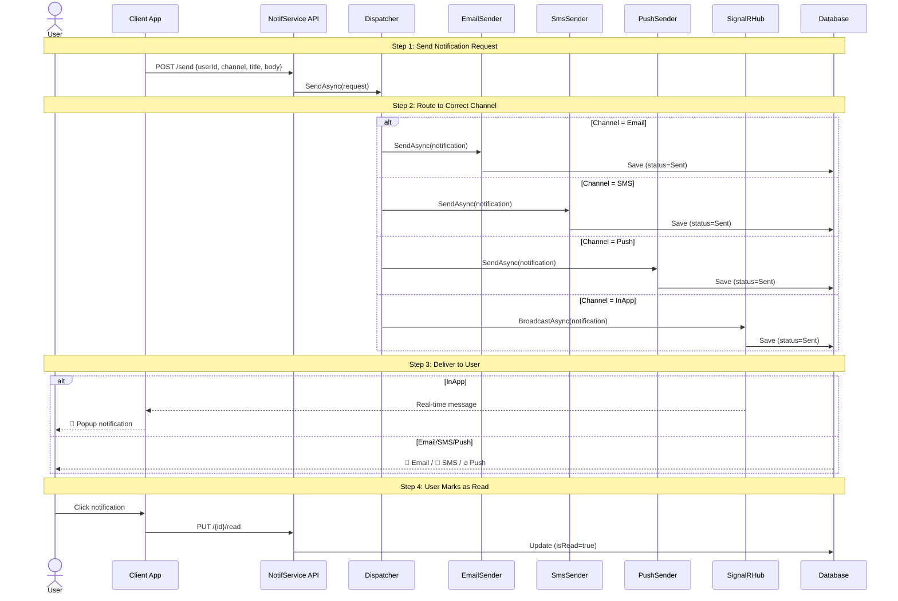
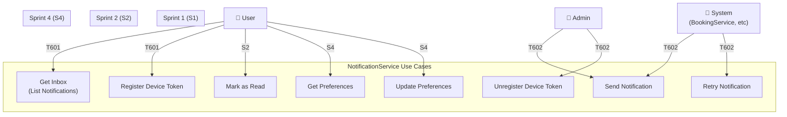
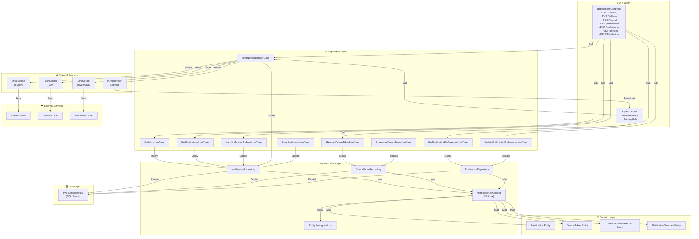
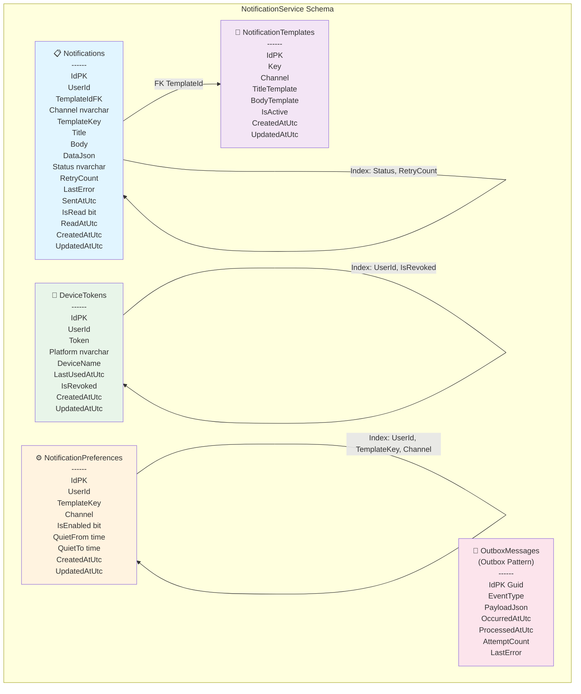
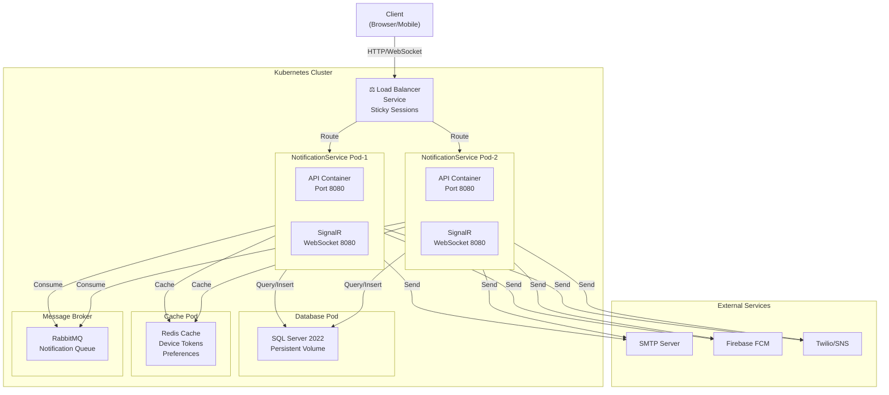
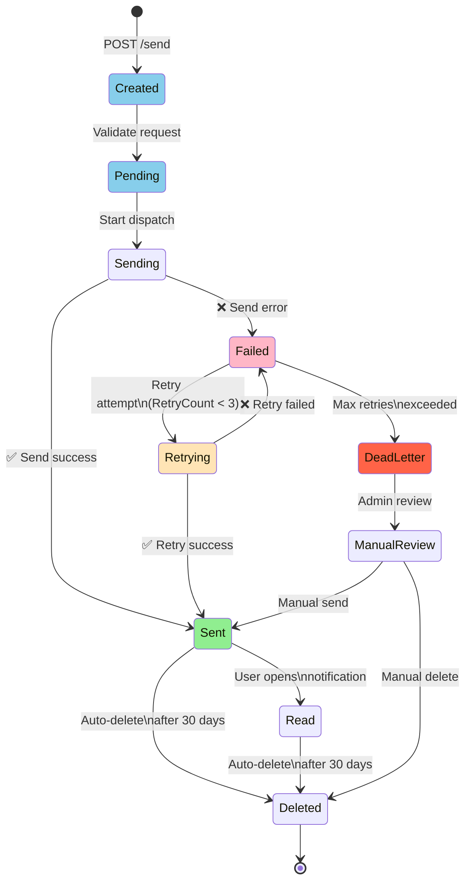
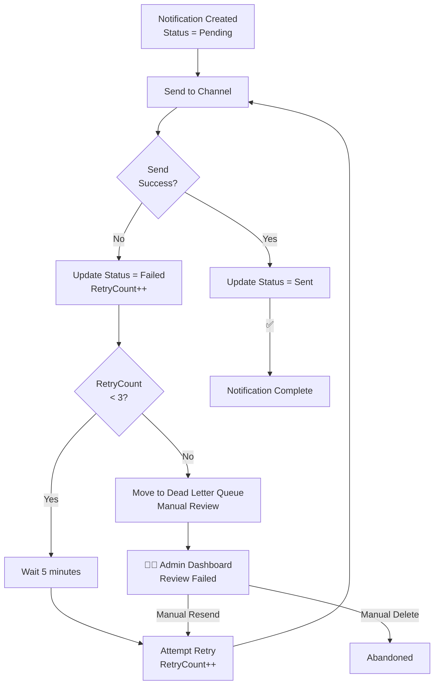

# 📐 NotificationService - Architecture Diagrams

## 1️⃣ System Context Diagram (C4 Level 1)



---

## 2️⃣ Container Diagram (C4 Level 2)



---

## 3️⃣ Notification Sending Flow



---

## 4️⃣ Use Case Diagram (Actor Model)



---

## 5️⃣ Component Diagram (NotificationService Internals)



---

## 6️⃣ Database Schema Diagram



---

## 7️⃣ Deployment Diagram (Docker & Kubernetes)



---

## 8️⃣ State Machine: Notification Lifecycle



---

## 9️⃣ Message Flow: Event-Driven Notification

```mermaid
graph LR
	subgraph "Source Service"
		BookingService["📅 BookingService<br/>Event: BookingCreated"]
	end

	MB["📬 RabbitMQ<br/>Exchange: notifications.exchange<br/>Queue: notifications.queue"]

	subgraph "NotificationService"
		Consumer["Consumer<br/>(Background Worker)"]
		Parser["Event Parser"]
		Dispatcher["Dispatcher"]
	end

	Channels["Channel Senders<br/>SMTP/FCM/SNS"]

	User["👤 User"]

	BookingService -->|Publish<br/>BookingCreated| MB
	MB -->|Subscribe| Consumer
	Consumer -->|Parse| Parser
	Parser -->|Extract Data| Dispatcher
	Dispatcher -->|Route Channel| Channels
	Channels -->|Send| User

	Note over ParserDispatcher: "Convert event to notification request"
```

---

## 🔟 Retry Strategy Flow



---

## Summary

- **8 Diagrams** covering all aspects of NotificationService
- **C4 Model** (Context, Container, Component, Code)
- **Flow Diagrams** (Sequence, State Machine, Event-Driven)
- **Infrastructure** (Deployment, Database, Architecture)

Sử dụng các diagrams này để:
1. 📚 Understand systems architecture
2. 🎓 Onboard new team members
3. 📋 Document requirements
4. 🧪 Design test scenarios
5. 🚀 Plan deployments
