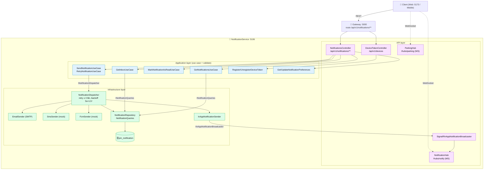
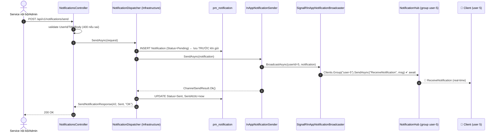
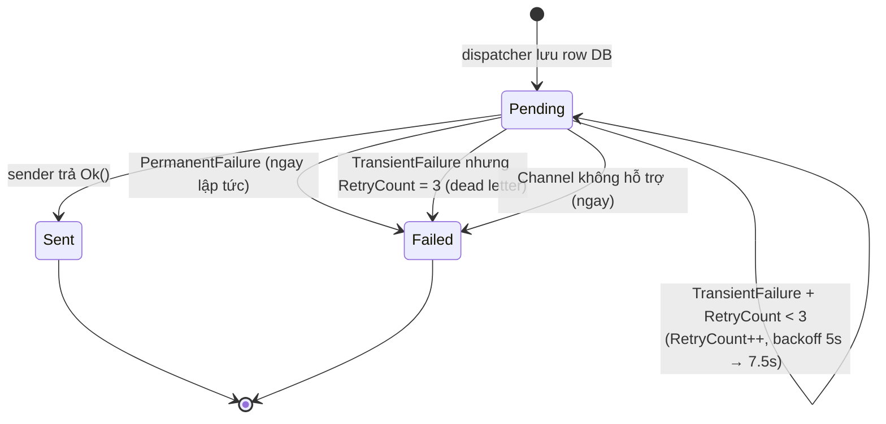
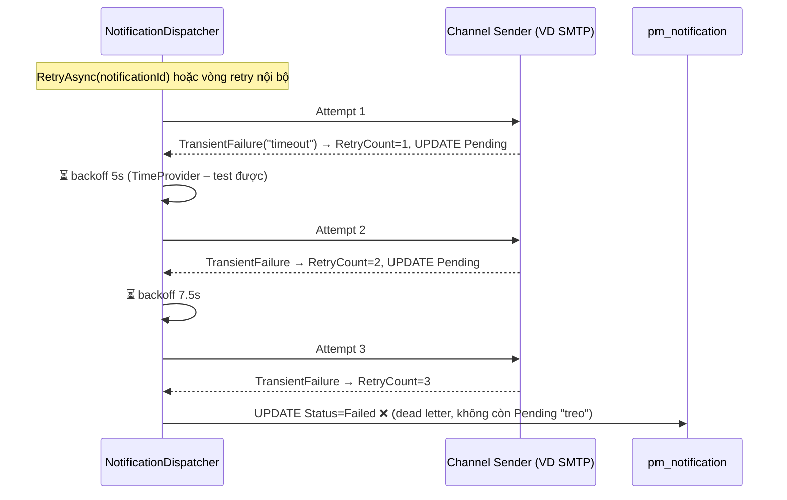

# 🔔 NotificationService – API Diagram (TV6)

Diagram chi tiết API của **NotificationService** (port `5106`, DB `pm_notification`, branch `feature/notification-service`).
Định dạng **Mermaid** – hiển thị trực tiếp trên GitHub/GitLab/VS Code.

> Tài liệu tổng thể: [`API_DIAGRAM.md`](../../API_DIAGRAM.md) ·
> [`API_SPECIFICATION.md`](../../API_SPECIFICATION.md) ·
> [`TESTING_GUIDE.md`](../../TESTING_GUIDE.md) (unit test bảo vệ cả 2 path retry).

---

## 1️⃣ Component – request đi qua các layer



**Ghi chú:** Gateway route `/api/v1/notifications/**`; ⚠️ `/api/v1/devices` và `/hubs/*` gọi
trực tiếp `:5106` (chưa có route Gateway).

---

## 2️⃣ Sequence – `POST /send` thành công (kênh InApp, real-time)



---

## 3️⃣ Retry semantics – phân biệt Transient vs Permanent (feedback PR)

> **Quy tắc:** chỉ lỗi **TẠM THỜI** (`ChannelSendResult.IsTransient`, VD timeout/mất mạng) mới được
> giữ `Pending` + tăng `RetryCount` để retry (tối đa `MaxRetryAttempts = 3`, backoff 5s × 1.5ⁿ).
> Lỗi **VĨNH VIỄN** (sai cấu hình, mailbox không tồn tại, channel không hỗ trợ) → `Failed` **ngay**,
> không retry vô ích → monitoring không bao giờ thấy notification "Pending" mãi mãi.





**Bảo vệ bằng unit test** (`NotificationDispatcherTests.cs`, dùng NSubstitute + FakeTimeProvider):
`SendAsync_transient_failure_exhausts_retries_marks_failed` ·
`SendAsync_transient_failure_then_success_retries_until_sent` ·
`SendAsync_permanent_failure_marks_failed_immediately_without_retry` ·
`RetryAsync_transient_with_remaining_budget_stays_pending` ·
`RetryAsync_exhausted_budget_marks_failed_without_sending`.

---

## 4️⃣ REST Endpoint Map – 7 endpoint + 2 hub

| # | Method | Route | Use case | Success | Lỗi |
|---|--------|-------|----------|---------|-----|
| 1 | GET | `/api/v1/notifications?userId=&unreadOnly=&page=&pageSize=` | `GetInboxUseCase` | 200 `NotificationInboxDto` | 400 userId≤0, page/pageSize ngoài 1–100 |
| 2 | PUT | `/api/v1/notifications/{id}/read?userId=` | `MarkNotificationAsReadUseCase` | 204 | 400 id/userId≤0, 500 |
| 3 | POST | `/api/v1/notifications/send` *(internal)* | `INotificationDispatcher.SendAsync` | 200 `SendNotificationResponse` | 400, 500 |
| 4 | GET | `/api/v1/notifications/preferences?userId=` | `GetNotificationPreferencesUseCase` | 200 `GetPreferencesResponse` | 400, 500 |
| 5 | PUT | `/api/v1/notifications/preferences?userId=` | `UpdateNotificationPreferencesUseCase` | 204 | 400, 500 |
| 6 | POST | `/api/v1/devices` | `RegisterDeviceTokenUseCase` | 201 | 400, 500 |
| 7 | DELETE | `/api/v1/devices/{deviceId}?userId=` | `UnregisterDeviceTokenUseCase` | 204 | 400, 500 |
| — | WS | `/hubs/notify` · `/hubs/parking` | SignalR real-time | — | — |

```json
// POST /api/v1/notifications/send          → 200
// Request                                   // Response
{                                            {
  "userId": 5,                                 "notificationId": 42,
  "channel": "Email",      // InApp|Email|Sms|Push
  "templateKey": "BOOKING_CONFIRMED",          "status": "Sent",   // Sent | Pending | Failed
  "title": "Đặt chỗ thành công",               "message": "OK"     // lỗi cuối nếu Failed
  "body": "Booking BK-0002 đã được xác nhận.", }
  "dataJson": "{\"bookingId\":12}"
}
```

---

## 5️⃣ SignalR real-time – 2 hub (WebSocket, gọi trực tiếp `:5106`)

```mermaid
graph LR
	subgraph HN["🛰 /hubs/notify – notification push"]
		G1["Group user-{userId}"]
		E1["📨 ReceiveNotification"]
		E2["💓 HeartbeatAck"]
	end
	subgraph HP["🛰 /hubs/parking – slot & capacity"]
		G2["Group lot-{parkingLotId}"]
		E3["📍 SubscribedToLot / UnsubscribedFromLot"]
		E4["🔄 SlotStateChanged"]
		E5["📊 CapacityChanged"]
	end
	ClientA["📱 Client user"] -->|"connect + JWT (claim sub) hoặc ?userId=| HN
	ClientB["📱 Map view"] -->|"SubscribeToLotAsync(lotId)"| HP
```

| Hub | Server methods | Cleanup khi disconnect |
|---|---|---|
| `/hubs/notify` | `SendNotificationToUserAsync(userId, msg)` · `BroadcastNotificationAsync(msg)` · `HeartbeatAsync()` | SignalR tự rời group `user-{id}` → không stale, nhiều connection/user vẫn đúng |
| `/hubs/parking` | `SubscribeToLotAsync(lotId)` · `UnsubscribeFromLotAsync(lotId)` · `BroadcastSlotStateChangeAsync(lotId, msg)` · `BroadcastCapacityChangeAsync(lotId, msg)` | SignalR tự rời group `lot-{id}` |

> ✅ **Fix feedback PR (fire-and-forget):** mọi broadcast giờ dùng **1 lệnh `Clients.Group(...)`
> .SendAsync(...)` có `await`** – không còn loop `Clients.Client(id).SendAsync(...)` không await,
> không còn dictionary tĩnh `LotSubscriptions` + lỗi thừa `await base.OnConnectedAsync()` trong
> `BroadcastSlotStateChangeAsync`. Tên method/event giữ nguyên nên client không phải đổi code.

---

## 6️⃣ Error mapping

| Tình huống | HTTP / kết quả |
|---|---|
| `userId ≤ 0`, `Title/Body` trống, page/pageSize ngoài 1–100 (validate ở controller/use case) | `400 BadRequest` |
| Use case / dispatcher ném exception không lường trước | `500 { message, error }` |
| Dispatcher: channel không hỗ trợ / permanent failure / hết lượt retry | `200` với `status = "Failed"` + `message` = lỗi cuối (request vẫn hợp lệ nên không phải 4xx) |
| `RetryAsync` notification không tồn tại | `200` với `status = "Failed"`, `"Notification không tìm thấy"` (không 404) |
| Gửi OK | `200` `status = "Sent"` · lỗi tạm thời còn lượt retry → `status = "Pending"` |

---

## 🔗 Liên quan

- [`../../API_DIAGRAM.md`](../../API_DIAGRAM.md) – API topology toàn hệ thống (9 service + Gateway)
- [`../../API_SPECIFICATION.md`](../../API_SPECIFICATION.md) – chi tiết DTO/enum của NotificationService
- [`../../TESTING_GUIDE.md`](../../TESTING_GUIDE.md) – 60 unit test bảo vệ các path (gồm retry transient/permanent)

