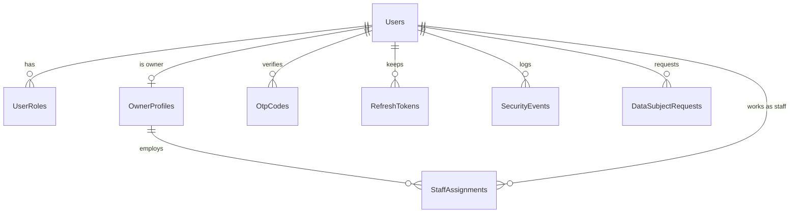
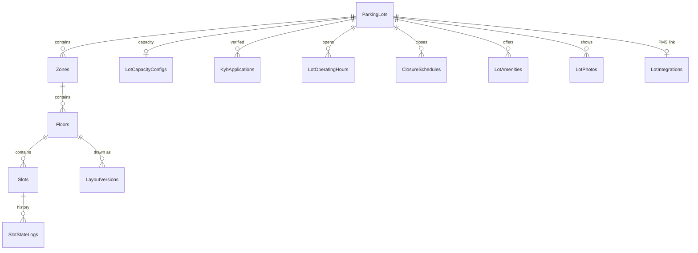
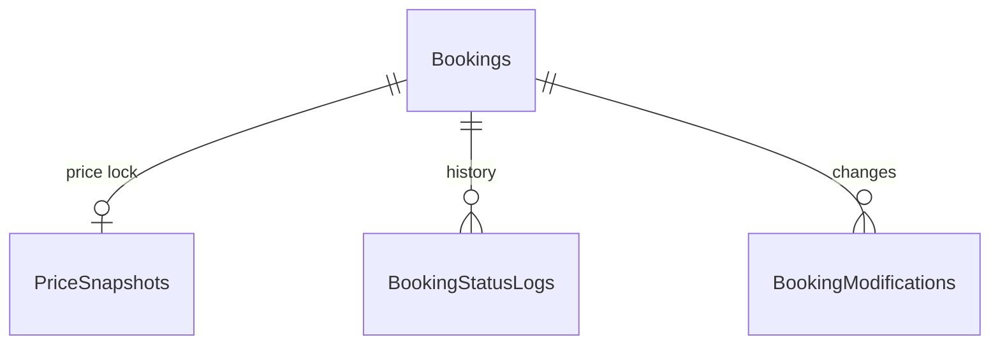
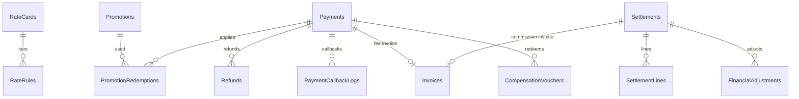
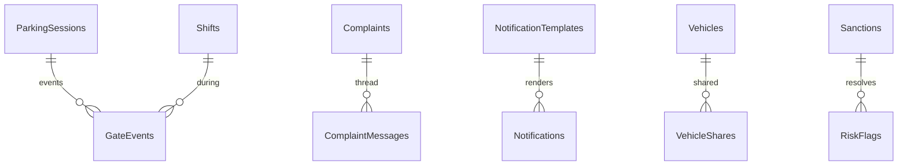

# Database – Database-per-Service

Mỗi service sở hữu **1 database riêng** trên PostgreSQL và là service DUY NHẤT được đọc/ghi database đó.
Thiết kế dựa trên: SRS v2, Đặc tả chức năng v3, Nghiệp vụ & Quản trị Marketplace v3, Kiến trúc v3, Kế hoạch kiểm thử v3,
Answer_01 → 09, 61 Use Case và 115 User Story.

**Tổng cộng: 9 database · 59 bảng nghiệp vụ · 41 khóa ngoại bên trong service.**
Mỗi database còn có `OutboxMessages` (sự kiện chờ gửi cho service khác) và `__EFMigrationsHistory`.

| Database | Service | Bảng | FK |
|---|---|---|---|
| pm_user | UserService | Users, UserRoles, OtpCodes, RefreshTokens, OwnerProfiles, StaffAssignments, SecurityEvents, DataSubjectRequests | 8 |
| pm_vehicle | VehicleService | Vehicles, VehicleShares | 1 |
| pm_parking | ParkingService | ParkingLots, Zones, Floors, Slots, LayoutVersions, KybApplications, LotCapacityConfigs, LotOperatingHours, ClosureSchedules, LotAmenities, LotPhotos, LotIntegrations, SlotStateLogs, ExternalParkingLots | 12 |
| pm_booking | BookingService | Bookings, PriceSnapshots, BookingStatusLogs, BookingModifications, MonthlyPasses | 3 |
| pm_payment | PaymentService | RateCards, RateRules, Promotions, PromotionRedemptions, Holidays, Payments, PaymentCallbackLogs, Refunds, Invoices, CompensationVouchers, Settlements, SettlementLines, FinancialAdjustments | 12 |
| pm_notification | NotificationService | Notifications, NotificationTemplates, NotificationPreferences, DeviceTokens | 1 |
| pm_gate | GateService | ParkingSessions, GateEvents, Shifts, GateDevices | 2 |
| pm_admin | AdminService | SystemConfigs, FeatureFlags, Sanctions, AuditLogs, RiskFlags | 1 |
| pm_support | SupportService | Complaints, ComplaintMessages, Reviews, FaqArticles | 1 |

Mỗi service hiện có **1 migration duy nhất** `InitialCreate` (đã tạo lại trên Npgsql, gộp toàn bộ sơ đồ 59 bảng + `AddDocumentCoverage`).

---

## 1. Truy vết: Epic / User Story → bảng

| Epic | User Story | Bảng lưu dữ liệu |
|---|---|---|
| EP01 Tài khoản & Xác thực | US-001→004 đăng ký, OTP, khóa 15′, JWT | UserService · Users, UserRoles, OtpCodes, RefreshTokens, **SecurityEvents** |
| | US-005 KYC CCCD/GPLX | UserService · Users (cột Kyc*, mã hóa AES-256) |
| | US-006, US-007 hồ sơ & quyền dữ liệu (NĐ 13) | UserService · Users, **DataSubjectRequests** |
| EP02 Garage | US-009→012 thêm/sửa xe, 10 xe, EV, quá khổ | VehicleService · Vehicles |
| | US-013 chia sẻ xe *(Phase 2)* | VehicleService · **VehicleShares** |
| EP03 Tìm kiếm | US-014→016 GPS, chiều cao, lọc tiện ích | ParkingService · ParkingLots (+City/District), Floors, **LotAmenities** |
| | US-018→020 chi tiết, ảnh, sơ đồ 2D | ParkingService · **LotPhotos**, LayoutVersions, Slots |
| | US-021 ước tính chi phí | PaymentService · RateCards, RateRules, **Holidays** |
| EP04 Đặt chỗ | US-022→028 giữ chỗ 15′, chống trùng, Price Lock | BookingService · Bookings, PriceSnapshots, BookingStatusLogs |
| | US-029, US-030 sửa / gia hạn | BookingService · **BookingModifications** |
| | US-031 bãi Mức 0 chủ bãi duyệt | BookingService · Bookings (RequiresOwnerApproval, PendingOwnerApproval) |
| EP05 Thanh toán | US-032, US-035 VNPAY / VietQR / tiền mặt | PaymentService · Payments |
| | US-033 callback an toàn, retry, idempotency | PaymentService · Payments (IdempotencyKey), **PaymentCallbackLogs** |
| | US-034 hoàn tiền tự động | PaymentService · Refunds |
| | US-036 hóa đơn phí đỗ + hóa đơn hoa hồng | PaymentService · Invoices (Type = ParkingFee / PlatformCommission) |
| EP06 Hủy & hoàn tiền | US-038→042 | BookingService · Bookings, BookingStatusLogs · PaymentService · Refunds |
| EP07 Check-in/out | US-043→048 QR, grace, overstay, ngoại lệ | GateService · ParkingSessions, GateEvents |
| | US-049 Staff ghi đè trạng thái slot | ParkingService · **SlotStateLogs** |
| | US-050, US-051 offline QR, OCR/ANPR | GateService · **GateDevices**, GateEvents |
| | US-052 tích hợp PMS Mức 1 | ParkingService · **LotIntegrations** |
| EP08 Onboarding KYB | US-053→056 | ParkingService · KybApplications · UserService · OwnerProfiles |
| | US-057 rời nền tảng | UserService · OwnerProfiles (Status, ExitRequestedAtUtc, ExitEffectiveAtUtc) |
| EP09 Cấu hình bãi | US-058→061 cây bãi, layout, phiên bản | ParkingService · Zones, Floors, Slots, LayoutVersions |
| | US-062 lịch hoạt động | ParkingService · **LotOperatingHours** |
| | US-063 tạm đóng 1 phần | ParkingService · **ClosureSchedules** |
| | US-064 tiện ích & ảnh | ParkingService · **LotAmenities**, **LotPhotos** |
| EP10 Sức chứa & Real-time | US-065→069 | ParkingService · Slots, LotCapacityConfigs, **SlotStateLogs**, **ClosureSchedules** (Emergency) |
| EP11 Biểu giá | US-070→072 | PaymentService · RateCards, RateRules, **Holidays** · AdminService · AuditLogs |
| | US-073 mã khuyến mãi | PaymentService · Promotions, **PromotionRedemptions** |
| EP12 Staff | US-075→077 | UserService · StaffAssignments · GateService · Shifts · AdminService · **RiskFlags** |
| EP13 Doanh thu & Quyết toán | US-078→082 | PaymentService · Payments, Settlements, SettlementLines, FinancialAdjustments, Invoices |
| EP14 Thông báo | US-083→086 | NotificationService · Notifications, NotificationTemplates, **DeviceTokens** |
| | US-087 tùy chỉnh thông báo | NotificationService · **NotificationPreferences** |
| EP15 Khiếu nại | US-088→090 ticket, phản hồi 48h, phán quyết | SupportService · Complaints, **ComplaintMessages** · PaymentService · Refunds |
| | US-091 bãi hết chỗ dù đã đặt | PaymentService · **CompensationVouchers** · AdminService · Sanctions (PenaltyAmount) |
| | US-092 FAQ | SupportService · **FaqArticles** |
| EP16 Đánh giá | US-093→095 | SupportService · Reviews |
| EP17 Quản trị | US-096→100 | UserService · Users · AdminService · Sanctions, SystemConfigs, FeatureFlags, AuditLogs |
| | US-101 bãi ngoài hệ thống *(Phase 2)* | ParkingService · **ExternalParkingLots** |
| EP18 Bảo mật & gian lận | US-102→104 RBAC, lạm dụng, leakage | UserService · UserRoles, **SecurityEvents** · AdminService · **RiskFlags** |
| EP20 Mở rộng | US-111 vé tháng *(Phase 2)* | BookingService · **MonthlyPasses** |
| | US-115 đa thành phố | ParkingService · ParkingLots (City, District) · PaymentService · Holidays (City) |

**Chưa có bảng (có chủ đích):** US-008 sinh trắc học (xử lý ở thiết bị), EP19 AI/3D (Phase 2, bật bằng FeatureFlags),
US-112 Membership, US-113 sạc EV, US-114 B2B Fleet (mentor xếp "Won't – this phase").

---

## 2. Sơ đồ quan hệ bên trong từng service

*UserService*

*ParkingService (ExternalParkingLots đứng riêng)*

*BookingService (MonthlyPasses đứng riêng)*

*PaymentService (Holidays đứng riêng)*

*GateService · SupportService · NotificationService · VehicleService · AdminService*

---

## 3. Tham chiếu giữa các service

PostgreSQL không cho tạo khóa ngoại sang database khác, và theo nguyên lý microservice các service cũng không JOIN database
của nhau. Cột trỏ sang service khác **chỉ lưu ID** (comment `→ <Service> (không FK)` trong code), kèm cột **snapshot** để hiển thị.

| Bảng | Cột | Trỏ tới | Snapshot |
|---|---|---|---|
| UserService · StaffAssignments | ParkingLotId | ParkingService | |
| ParkingService · ParkingLots | OwnerProfileId | UserService | |
| ParkingService · Slots, SlotStateLogs | DedicatedVehicleId, BookingId, ParkingSessionId, ChangedByUserId | Vehicle/Booking/Gate/UserService | |
| BookingService · Bookings, MonthlyPasses | UserId, VehicleId, ParkingLotId, ZoneId, SlotId, OwnerProfileId, PromotionId | User/Vehicle/Parking/PaymentService | PlateNumber, ParkingLotName, SlotCode, PromotionCode |
| BookingService · PriceSnapshots | RateCardId | PaymentService | RateCardJson (Price Lock) |
| GateService · ParkingSessions | BookingId, UserId, VehicleId, SlotId, ParkingLotId | Booking/User/Vehicle/ParkingService | BookingCode, SlotCode, PlateNumber |
| GateService · GateDevices | ParkingLotId | ParkingService | |
| PaymentService · Payments, PromotionRedemptions | BookingId, ParkingSessionId, UserId | Booking/Gate/UserService | BookingCode |
| PaymentService · Refunds, CompensationVouchers | ComplaintId, BookingId, UserId, ChargedToOwnerProfileId | Support/Booking/UserService | |
| NotificationService · Notifications, Preferences, DeviceTokens | UserId | UserService | |
| AdminService · Sanctions, AuditLogs, RiskFlags | OwnerProfileId, ParkingLotId, UserId, SubjectId | User/ParkingService | |
| SupportService · Complaints, Reviews, ComplaintMessages | UserId, BookingId, ParkingLotId, OwnerProfileId | User/Booking/ParkingService | BookingCode, ReviewerName |

**Giữ dữ liệu khớp nhau:** trước khi ghi, service gọi API của service sở hữu để kiểm tra ID; khi dữ liệu gốc đổi, service sở hữu
phát sự kiện (`SharedKernel/Contracts/IntegrationEvents.cs`) qua `OutboxMessages`. VD `PaymentSucceeded` → BookingService chuyển
booking sang `Confirmed`. `OwnerProfileId` là khóa tenant để chủ bãi A không xem được dữ liệu bãi B.

---

## 4. Quy ước chung (`ServiceDbContext` trong BuildingBlocks)

- Enum lưu dạng chuỗi, tiền `decimal(18,2)`, chuỗi mặc định `varchar(500)`.
- FK bên trong service là RESTRICT. `Users`, `Vehicles`, `ParkingLots`, `Reviews`, `ExternalParkingLots` dùng soft delete.
- `Slots`, `Bookings` có `RowVersion` chống 2 request cùng sửa 1 bản ghi.
- Index/ràng buộc chống sai dữ liệu tiêu biểu:
  - 1 biển số chỉ 1 lượt `Active` trong 1 bãi; 1 Dedicated Slot chỉ thuộc 1 vé tháng đang hiệu lực.
  - `Payments.IdempotencyKey` unique; mỗi booking chỉ dùng 1 mã khuyến mãi; mỗi booking chỉ đánh giá 1 lần.
  - Hóa đơn phí đỗ phải gắn Payment, hóa đơn hoa hồng phải gắn Settlement; mỗi bãi chỉ 1 ảnh bìa; mỗi bãi 1 dòng giờ mở/ngày.

## 5. Tạo / cập nhật database

**Cách 1 – chạy service** (`..\run-all.ps1`): mỗi service tự áp migration còn thiếu và nạp dữ liệu demo.
Database cũ (đã có `InitialCreate`) sẽ tự được nâng lên `AddDocumentCoverage`, giữ nguyên dữ liệu đang có.

**Cách 2 – psql / pgAdmin**: tạo database rỗng trước (`CREATE DATABASE pm_user;` …), rồi chạy `01_pm_user.sql` … `09_pm_support.sql`.
Script idempotent – chỉ áp phần migration còn thiếu nên chạy lại nhiều lần được. Cách này không có dữ liệu demo (chỉ tham số hệ thống, feature flag, mẫu thông báo, ngày lễ).

**Xem dữ liệu:** `00_XemNhanh.sql` (lưu ý: file này vẫn là T-SQL cũ, chưa chuyển sang psql).

## 6. Dữ liệu demo

Mật khẩu chung `Demo@123`. ID dùng chung giữa các service: `SharedKernel/Contracts/DemoIds.cs`.

| Id | Email | Vai trò |
|---|---|---|
| 1 | admin@smartparking.vn | Admin |
| 2 | owner.vincom@smartparking.vn | Chủ bãi (OwnerProfile 1: Vincom, Landmark 81) + Driver |
| 3 | owner.tsn@smartparking.vn | Chủ bãi (OwnerProfile 2: Tân Sơn Nhất, Bến Thành) |
| 4 | staff.vincom@smartparking.vn | Nhân viên cổng bãi Vincom |
| 5 | driver1@smartparking.vn | Tài xế – xe 1: 51F-123.45, xe 2: 30A-678.90 (có vé tháng MP-0001, chia sẻ cho driver2) |
| 6 | driver2@smartparking.vn | Tài xế – xe 3: 51H-919.91 (xe điện), có voucher đền bù COMP-0001 |

Ngoài ra: 4 bãi (Active / Active / chờ KYB / bị tạm dừng) kèm giờ mở cửa, tiện ích, ảnh, lịch tạm đóng, kết nối PMS;
192 slot + lịch sử trạng thái; 3 booking (1 có lịch sử sửa giờ); 2 lượt gửi xe; 6 thiết bị cổng; 2 thanh toán + 3 log callback
(1 bị nhận diện trùng); 11 ngày lễ 2027; 1 khiếu nại kèm hội thoại; 6 FAQ; 3 cờ rủi ro; 24 tham số hệ thống; 8 feature flag.

**Làm lại từ đầu:** xóa cả 9 database `PM_*` rồi chạy `run-all.ps1` (ID demo giữa các service chỉ khớp khi tạo mới cùng lúc).
